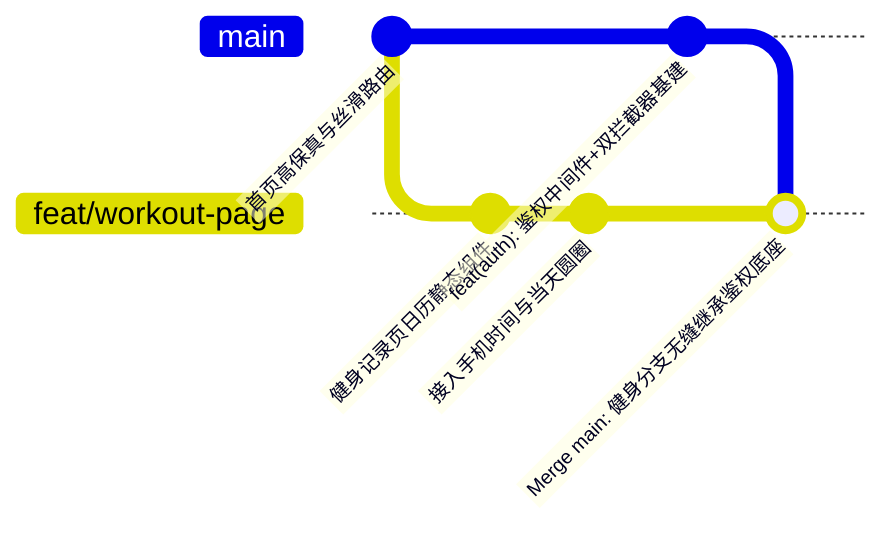

# 豆丁健身 (douding-fitness) - 全栈登录鉴权与双拦截器基建落地方案与使用说明

> **报告版本**：v1.0.0  
> **完成时间**：2026-10-08  
> **适用对象**：项目全体开发（大白话通俗版）  
> **归属分支**：已沉淀至 `main` 主干分支，并已无缝合并至 `feat/workout-page`  
> **文档位置**：`docs/技术报告/全栈登录鉴权与双拦截器基建落地方案与使用说明.md`

---

## 目录
1. [大白话总结：我们刚才到底干了什么？](#一-大白话总结我们刚才到底干了什么)
2. [后端（Server）做好了哪些底座？](#二-后端server做好了哪些底座)
3. [前端（Client）做好了哪些拦截能力？](#三-前端client做好了哪些拦截能力)
4. [Git 分支是怎么操作的？（为什么先切 main）](#四-git-分支是怎么操作的为什么先切-main)
5. [怎么验证与使用？（实操步骤）](#五-怎么验证与使用实操步骤)
6. [后续写业务接口时，有多爽？（代码示范）](#六-后续写业务接口时有多爽代码示范)

---

## 一、 大白话总结：我们刚才到底干了什么？

简单一句话：**我们把整套全栈项目的“身份证核验通道”和“免密开发绿灯”彻底建好了！**

### 解决了什么实际痛点？
1. **之前**：如果你写“保存健身打卡”接口，数据库必须记录这到底是谁练的（`userId`）。如果没做鉴权，你只能在代码里写死一个假 ID，或者让前端把用户 ID 传过来（这在生产环境有极严重的被抓包篡改漏洞）。以后做登录时，所有写好的接口全得删掉重写。
2. **现在**：
   - 后端搭好了标准的 **JWT“身份证检查站”**。
   - 数据库里预先灌入了一个合法的测试铁粉用户（`test-user-001`）。
   - 前端发任何请求，拦截器会自动把这个“身份证”塞在请求头里带过去。
   - 后端接口一秒解出当前操作者是谁，未来接入微信真实登录时，**所有业务代码一行都不用改，零返工成本！**

---

## 二、 后端（Server）做好了哪些底座？

我们为 Node.js 后端服务武装了以下 5 个核心模块：

### 1. JWT 身份证制作与验真工具 (`server/src/utils/jwt.ts`)
- `signToken({ userId })`：根据用户 ID 生成一段防伪签名、有效期 7 天的加密 Token 字符串。
- `verifyToken(token)`：校验前端发过来的 Token 是否真实合法，解出当前用户的 `userId`。

### 2. TypeScript 类型扩展 (`server/src/types/express.d.ts`)
- 给 Express 的 `Request` 对象合法注入了 `userId` 属性，彻底解决写代码时 TypeScript 抱怨 `req.userId` 不存在的报错。

### 3. 全局鉴权拦截中间件 (`server/src/middlewares/auth.middleware.ts`)
- 作为一道安全门神，挂载在需要保护的业务路由前：
  - 如果前端没带 Token 或格式错误 ➜ 自动打回 `401 Unauthorized`；
  - 如果 Token 过期或被篡改 ➜ 自动打回 `401 登录状态已失效`；
  - 只有合法请求，它才解出 `req.userId` 并放行到下游业务接口。

### 4. 开发专用免密登录接口 (`server/src/controllers/auth.controller.ts`)
- **路由**：`POST /api/auth/dev-login`
- **作用**：前端或接口调试工具（Apifox/Postman）直接发一个请求，就能**一秒拿到合法测试用户的真实 Token**，彻底规避了微信小程序官方 `code` 只能用一次且 5 分钟失效的调试痛苦！
- 同时预留好了 `POST /api/auth/wechat-login`，未来只用往里填入微信官方的换取 openid 逻辑即可。

### 5. 数据库测试账号自动灌库 (`server/prisma/seed.ts`)
- 执行 `pnpm prisma:seed`，Prisma 会自动在 SQLite 本地数据库里插入一个完整的测试用户：
  - **ID**：`test-user-001`
  - **昵称**：`豆丁铁粉`
  - **身高/体重**：`175cm / 72.5kg`
  - **目标体重**：`68.0kg`

---

## 三、 前端（Client）做好了哪些拦截能力？

在 [`client/src/api/request.ts`](file:///d:/douding-fitness/client/src/api/request.ts) 中升级了**生产级双拦截器**：

### 1. 请求拦截器（发请求前）
- **自动拼接根域名**：自动将相对路径 `/workout/month` 补充为 `http://localhost:3000/api/workout/month`。
- **自动携带 Token**：自动读取手机本地 Storage 中的 Token，并以标准的 `Authorization: Bearer <token>` 格式注入请求头。页面调用接口时再也不需要手动传 header！

### 2. 响应拦截器（收到数据后）
- **401 登录过期自动拦截**：
  - 当后端判定 Token 过期时，拦截器自动清空本地失效缓存。
  - 带**防抖保护**弹出“登录已过期，请重新登录”吐司，避免页面多个接口同时报错时屏幕疯狂闪烁。
- **业务数据自动解包**：
  - 后端返回的标准结构形如 `{ code: 200, message: 'success', data: { ... } }`。
  - 前端调用 `await request(...)` 时，拦截器直接解包把里面的 `data` 拿出来交给页面，免去业务层每次写 `.data.data` 的烦恼；如果 `code !== 200`，拦截器自动提取后端报错信息弹出 Toast，绝不让页面静默崩溃。

### 3. 工具方法导出
- 导出了 `getToken()`、`setToken(token)`、`clearToken()`、`isLoggedIn()`，供后续全工程随时随地便捷调用。

---

## 四、 Git 分支是怎么操作的？（为什么先切 main）

严格遵守了你的英明决断：**“公共基建必须留在 main”**。



1. 我们先安全切回 `main` 分支；
2. 在 `main` 上把上述全套鉴权底座做完，编译测试通过后提交：  
   `a41a97a feat(auth): 搭建全栈 JWT 鉴权中间件、双拦截器与开发测试环境`；
3. 切回当前的健身记录分支 `feat/workout-page`，执行 `git merge main` 将基建成果一键合并过来；
4. 健身分支瞬间拥有了最新的鉴权底座，且**零冲突、零代码污染**！

---

## 五、 怎么验证与使用？（实操步骤）

### 1. 验证后端接口与生成测试 Token
在终端进入 `server/` 目录，执行测试：
```bash
# 启动后端服务
pnpm dev
```
使用任何工具（如 Postman、Apifox、或浏览器控制台）向后端发起请求：
- **请求方式**：`POST http://localhost:3000/api/auth/dev-login`
- **请求体 (JSON)**：`{ "userId": "test-user-001" }`
- **返回结果**：立即返回状态码 200、完整的测试用户信息、以及一串 7 天有效的 Bearer Token！

### 2. 小程序前端怎么开始带 Token 测试？
在开发阶段，如果想让小程序发出的所有请求都带上这个合法身份，只需要在微信开发者工具的 Console 控制台敲入一行：
```javascript
// 写入一次，微信开发者工具本地就会永久记住
uni.setStorageSync('token', '从上面接口拿到的 token 字符串');
```
之后你无论点日历、点打卡、还是查历史，后端拦截器都会识别你是合法的 `test-user-001` 用户！

---

## 六、 后续写业务接口时，有多爽？（代码示范）

现在底座搭好后，接下来写“健身打卡保存接口”就会变得极其清爽、干净和安全：

### 后端 Controller 代码（示范）
```typescript
// server/src/controllers/workout.controller.ts
export async function createWorkout(req: Request, res: Response) {
  // 1. 直接从 req 中获取！绝不需要前端传 userId，安全第一
  const userId = req.userId!; 

  const { date, duration, bodyParts, notes } = req.body;

  // 2. 数据库写入，天然绑定当前合法用户
  const record = await prisma.workoutRecord.create({
    data: {
      userId,
      date,
      duration,
      bodyParts,
      notes,
    }
  });

  res.json({ code: 200, message: '打卡成功', data: record });
}
```

### 后端路由配置（示范）
```typescript
// server/src/routes/workout.route.ts
import { authMiddleware } from '../middlewares/auth.middleware';

// 只要挂上 authMiddleware，未登录的人连进都进不来！
router.post('/record', authMiddleware, createWorkout);
```

这就是我们刚刚完成的全部底座工作。地基已经扎实如磐石，随时可以正式启动健身打卡真实接口的联调！
