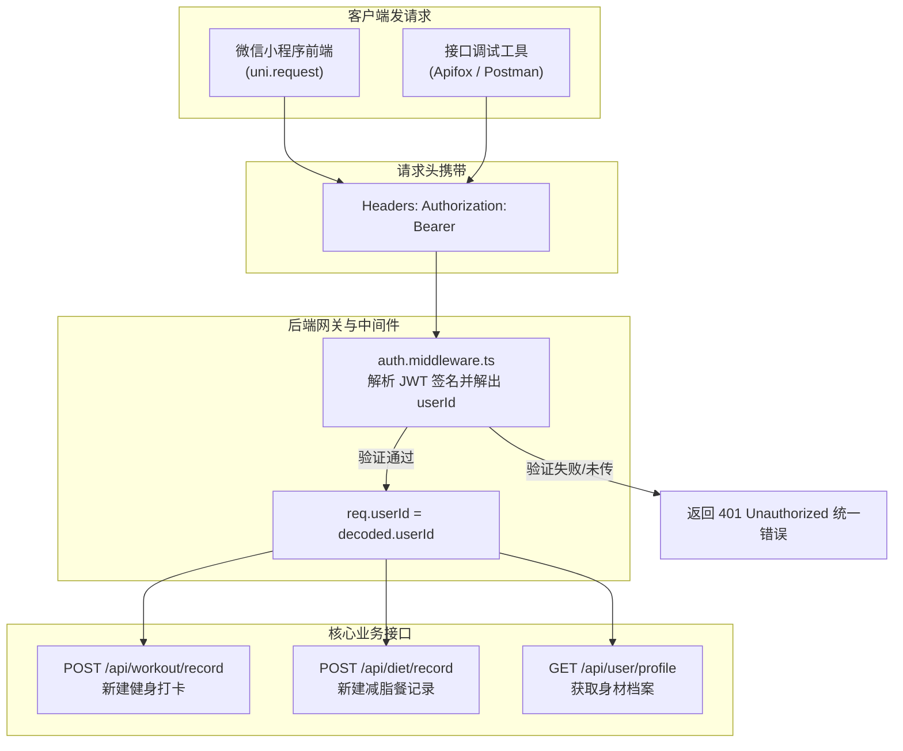
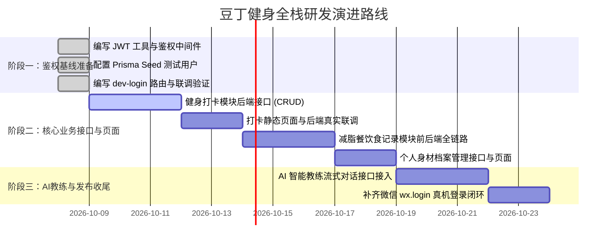

# 豆丁健身 (douding-fitness) - v1 后端接口与数据库开发前登录鉴权准备方案

> **版本**：v1.0.0  
> **更新时间**：2026-10-08  
> **文档定位**：在启动核心业务接口（健身打卡、减脂餐饮食、个人身体档案）和数据库开发前，指导完成用户鉴权骨架、测试账号种子数据与全栈 Token 联调环境的准备，确保后续业务开发零返工。

---

## 目录
1. [背景与核心痛点分析](#一-背景与核心痛点分析)
2. [总体架构策略：双轨制 Token 认证方案](#二-总体架构策略双轨制-token-认证方案)
3. [数据库层面准备 (Prisma & Seed 数据)](#三-数据库层面准备-prisma--seed-数据)
4. [后端鉴权骨架准备任务 (Server)](#四-后端鉴权骨架准备任务-server)
   - 4.1 JWT 工具模块 (`utils/jwt.ts`)
   - 4.2 TypeScript Request 类型扩展 (`types/express.d.ts`)
   - 4.3 统一鉴权拦截中间件 (`middlewares/auth.middleware.ts`)
   - 4.4 开发/测试登录与真实微信登录路由设计
5. [前端客户端准备与注入机制 (Client)](#五-前端客户端准备与注入机制-client)
6. [全栈开发推进里程碑推荐](#六-全栈开发推进里程碑推荐)
7. [避坑指南与最佳实践](#七-避坑指南与最佳实践)

---

## 一、 背景与核心痛点分析

### 1.1 业务强依赖：所有数据表必须绑定 `userId`
在 `server/prisma/schema.prisma` 中：
* 健身打卡记录表 `WorkoutRecord` 含有字段 `userId String`（外键关联 `User` 表）。
* 减脂餐打卡记录表 `DietRecord` 含有字段 `userId String`（外键关联 `User` 表）。
* 动作明细表 `ExerciseItem` 级联归属于打卡记录。

**结论**：在编写任何保存/查询打卡记录的后端接口时，第一步都必须拿到当前操作者的 `userId`。

### 1.2 传统死磕微信登录的开发痛点
如果一上来就把全部精力放在微信官方的真实登录流程上，会遇到以下巨大阻碍：
1. **微信 `code` 只能使用一次且 5 分钟失效**：在用 Apifox、Postman 等接口调试工具自测时，无法自动化重复发起带真实 `code` 的请求。
2. **微信开发环境门槛**：涉及微信开发者工具、AppID/AppSecret 配置、测试号权限及开发网内联通，容易卡在微信服务网络环境排查中。
3. **阻塞核心业务进度**：健身打卡、减脂餐分析、日历视图等是小程序的核心业务闭环，过早深陷登录授权 UI 和手机号授权规范，会严重拖慢整体节奏。

### 1.3 解决方针：鉴权骨架先行，核心业务畅通
* **不做**：先不强求立即联调微信官方的 `wx.login` 真机流程。
* **要做**：**必须先把后端的 JWT 鉴权中间件搭好**，并准备好**长期有效的测试用户与 Token 生成机制**。
* **效果**：后续写任何业务 Controller 时，均标准规范地直接使用 `req.userId`。未来接入真实微信登录时，业务代码**一行不需要修改，零重构成本无缝切换**。

---

## 二、 总体架构策略：双轨制 Token 认证方案

通过“双轨制”保证开发期测试效率与生产期安全性：



### 两种获取 Token 的轨道：
1. **轨道 A（开发/联调测试）：**
   - 提供一个本地专用的开发登录接口 `/api/auth/dev-login`（或固定预生成一个长达 30 天的测试 Token）。
   - 前端或 Apifox 直接调用，一键拿到绑定指定测试用户的 Token。
2. **轨道 B（生产/真机发布）：**
   - 前端调用 `uni.login` 得到 `code`。
   - 请求 `/api/auth/wechat-login`，后端调用微信官方 `https://api.weixin.qq.com/sns/jscode2session` 换取 `openid`，查库或创建用户，返回结构完全一致的 JWT Token。

---

## 三、 数据库层面准备 (Prisma & Seed 数据)

在开发打卡和用户接口之前，数据库必须至少有一条可用的 `User` 测试记录。

### 3.1 预设测试用户规范
* **ID**：`test-user-001`
* **OpenID**：`mock_openid_test_001`
* **昵称**：`豆丁铁粉`
* **身高**：`175.0 cm`
* **当前体重**：`72.5 kg`
* **目标体重**：`68.0 kg`

### 3.2 编写种子数据脚本 (`server/prisma/seed.ts`)
在 `server/prisma/` 下创建 `seed.ts`：

```typescript
import { PrismaClient } from '@prisma/client';

const prisma = new PrismaClient();

async function main() {
  console.log('🌱 开始初始化测试数据...');

  const testUser = await prisma.user.upsert({
    where: { id: 'test-user-001' },
    update: {},
    create: {
      id: 'test-user-001',
      openid: 'mock_openid_test_001',
      nickname: '豆丁铁粉',
      avatarUrl: 'https://images.unsplash.com/photo-1535713875002-d1d0cf377fde?w=150',
      gender: 1, // 男
      height: 175.0,
      weight: 72.5,
      targetWeight: 68.0,
    },
  });

  console.log('✅ 测试用户初始化成功:', testUser);
}

main()
  .catch((e) => {
    console.error('❌ 初始化数据失败:', e);
    process.exit(1);
  })
  .finally(async () => {
    await prisma.$disconnect();
  });
```

### 3.3 配置 package.json 执行命令
在 `server/package.json` 中补充 Prisma seed 配置：
```json
{
  "prisma": {
    "seed": "tsx prisma/seed.ts"
  },
  "scripts": {
    "prisma:seed": "tsx prisma/seed.ts"
  }
}
```
执行 `pnpm prisma:seed` 即可一键完成测试用户灌库。

---

## 四、 后端鉴权骨架准备任务 (Server)

在开发打卡 Controller 之前，必须在 `server/src` 补齐以下 4 个文件：

```
server/src/
├── types/
│   └── express.d.ts          # 扩展 Express.Request 类型（支持 req.userId）
├── utils/
│   └── jwt.ts                # JWT 签名与验签工具封装
├── middlewares/
│   └── auth.middleware.ts    # 路由鉴权拦截中间件
└── routes/
    └── auth.routes.ts        # 登录认证相关路由（包含 dev-login 与 wechat-login 预留）
```

### 4.1 JWT 工具模块 (`server/src/utils/jwt.ts`)
```typescript
import jwt from 'jsonwebtoken';
import { config } from '../config';

const JWT_SECRET = process.env.JWT_SECRET || 'douding-fitness-secret-key-2026';
const JWT_EXPIRES_IN = process.env.JWT_EXPIRES_IN || '7d';

export interface TokenPayload {
  userId: string;
}

// 签发 Token
export function signToken(payload: TokenPayload): string {
  return jwt.sign(payload, JWT_SECRET, { expiresIn: JWT_EXPIRES_IN });
}

// 校验并解密 Token
export function verifyToken(token: string): TokenPayload | null {
  try {
    return jwt.verify(token, JWT_SECRET) as TokenPayload;
  } catch (error) {
    return null;
  }
}
```

### 4.2 TypeScript Request 类型扩展 (`server/src/types/express.d.ts`)
避免在 Controller 中读取 `req.userId` 出现 TS 报错：
```typescript
import express from 'express';

declare global {
  namespace Express {
    interface Request {
      userId?: string;
    }
  }
}
```

### 4.3 统一鉴权拦截中间件 (`server/src/middlewares/auth.middleware.ts`)
```typescript
import { Request, Response, NextFunction } from 'express';
import { verifyToken } from '../utils/jwt';

export function authMiddleware(req: Request, res: Response, next: NextFunction) {
  const authHeader = req.headers.authorization;

  if (!authHeader || !authHeader.startsWith('Bearer ')) {
    return res.status(401).json({
      code: 401,
      message: '未登录或认证令牌格式错误 (需要 Bearer Token)',
    });
  }

  const token = authHeader.split(' ')[1];
  const payload = verifyToken(token);

  if (!payload || !payload.userId) {
    return res.status(401).json({
      code: 401,
      message: '登录状态已失效，请重新登录',
    });
  }

  // 将解析出的 userId 挂载到 req 对象上，下游业务 Controller 随时使用
  req.userId = payload.userId;
  next();
}
```

### 4.4 开发/测试登录与真实微信登录控制器 (`server/src/controllers/auth.controller.ts`)
```typescript
import { Request, Response } from 'express';
import { signToken } from '../utils/jwt';
import prisma from '../prisma';

// 1. 开发专用登录：方便 Apifox/Postman/本地前端一键拿 Token
export async function devLogin(req: Request, res: Response) {
  const targetUserId = req.body.userId || 'test-user-001';
  
  const user = await prisma.user.findUnique({
    where: { id: targetUserId },
  });

  if (!user) {
    return res.status(404).json({ code: 404, message: '测试用户不存在，请先运行 seed' });
  }

  const token = signToken({ userId: user.id });

  res.json({
    code: 200,
    message: '开发模式登录成功',
    data: {
      token,
      user,
    },
  });
}

// 2. 真实微信登录（预留架构，后续填补 code2session）
export async function wechatLogin(req: Request, res: Response) {
  const { code } = req.body;
  if (!code) {
    return res.status(400).json({ code: 400, message: '缺少微信 code 参数' });
  }

  // TODO: 后续调用微信官方接口 https://api.weixin.qq.com/sns/jscode2session
  // 换取 openid，使用 prisma.user.upsert 创建/查找用户并返回 signToken({ userId: user.id })
  res.status(501).json({ code: 501, message: '微信登录接口待配置真实 AppSecret 后启用' });
}
```

---

## 五、 前端客户端准备与注入机制 (Client)

客户端已封装好了网络请求拦截器，只需要确保在开发阶段 Token 能够顺畅注入。

### 5.1 检查已有的请求拦截器 (`client/src/api/request.ts`)
当前拦截器已具备自动读取本地存储 Token 的能力：
```typescript
const token = uni.getStorageSync('token') || ''
// ...
header: {
  'Content-Type': 'application/json',
  Authorization: token ? `Bearer ${token}` : '',
  ...options.header,
}
```

### 5.2 开发阶段的“免登录自动注入”方案
在开发健身打卡与减脂餐页面时，避免每次热更新后因为没有 Token 导致页面接口报 401：
* **方法 1（推荐）**：在 `client/src/main.ts` 或 `App.vue` 的 `onLaunch` 阶段添加开发环境兜底：
```typescript
// App.vue
onLaunch(() => {
  // 开发环境下如果没有 token，自动设置一个默认测试 Token
  if (process.env.NODE_ENV === 'development') {
    const existingToken = uni.getStorageSync('token');
    if (!existingToken) {
      console.log('[Dev] 正在自动注入开发测试 Token...');
      // 可以在此处调用 /auth/dev-login 接口换取，或直接存入固定的开发 Token
    }
  }
});
```
* **方法 2**：在微信开发者工具调试器控制台执行一次：
```javascript
uni.setStorageSync('token', '从后端 /api/auth/dev-login 拿到的 token');
```
执行一次后，微信开发者工具的本地 Storage 会永久保存，后续写打卡页面、饮食打卡页面均与正式登录无异。

---

## 六、 全栈开发推进里程碑推荐



---

## 七、 避坑指南与最佳实践

1. **绝对不要在业务 Controller 中将 `userId` 作为前端请求体参数传递**：
   - ❌ 错误做法：`const { userId, bodyParts } = req.body;`（极度不安全，任何人只要抓包改了 `userId` 就能修改他人的健身记录）。
   - ✅ 正确做法：必须从鉴权中间件的 `req.userId` 中提取：`const userId = req.userId!;`。
2. **TypeScript 扩展类型不生效的问题**：
   - 确保 `server/tsconfig.json` 的 `include` 列表中包含了 `"src/**/*"`，使得 `types/express.d.ts` 能被编译器正确扫描到。
3. **SQLite 数据库只读/锁库问题**：
   - 使用 SQLite 时，在用 `prisma:studio` 查看数据的同时，尽量避免大量并发大批量写入，开发期单人调试完全足够。
4. **401 状态码的统一响应处理**：
   - 当 Token 过期时，`request.ts` 收到 401 状态码应自动清除失效的本地 Storage，并友好提示“登录已过期”。
