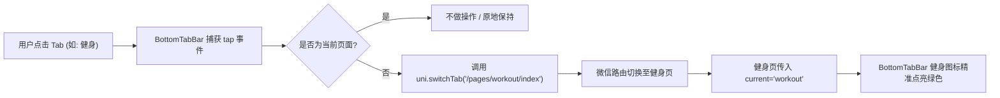

# 豆丁健身 (douding-fitness) - 底部导航路由跳转实施方案 (v1.0)

> **版本**：v1.0.0  
> **更新时间**：2026-09-24  
> **文档位置**：`D:\douding-fitness\docs\技术选型\v1-底部导航路由跳转实施方案.md`  
> **状态**：方案规划中（未进行任何业务代码修改）

---

## 目录
1. [方案背景与核心目标](#一-方案背景与核心目标)
2. [技术实现路线选型与权衡](#二-技术实现路线选型与权衡)
3. [路由与页面映射表](#三-路由与页面映射表)
4. [核心改造步骤规划 (Step-by-Step)](#四-核心改造步骤规划-step-by-step)
5. [路由跳转状态管理 (高亮同步)](#五-路由跳转状态管理-高亮同步)
6. [测试验证与验收标准](#六-测试验证与验收标准)

---

## 一、 方案背景与核心目标

### 1.1 现状说明
- 目前首页已拥有高保真底部导航组件 [`BottomTabBar.vue`](file:///d:/douding-fitness/client/src/pages/index/components/BottomTabBar.vue)。
- 点击“健身”、“饮食”、“AI”、“我的”目前仅弹出轻提示（Toast），尚未触发实际的物理页面跳转。
- 其余 4 个功能页面的骨架文件已在项目重构阶段全部创建完成（`pages/workout/index.vue`、`pages/diet/index.vue`、`pages/ai-coach/index.vue`、`pages/profile/index.vue`），并在 `pages.json` 中完成了基础声明。

### 1.2 本次任务边界
- **聚焦单一目标**：**只实现点击底部 5 个图标的页面路由跳转与高亮选中切换**。
- **严格约束**：不开发任何具体业务表单与接口逻辑，仅打通路由跳转闭环。

---

## 二、 技术实现路线选型与权衡

在 uni-app / 微信小程序中，底部多页面导航有两种落地方式：

| 对比维度 | 方案 A：微信原生 `tabBar` (pages.json 配置) | 方案 B：高保真自定义组件 (`BottomTabBar.vue` + 路由驱动) |
| :--- | :--- | :--- |
| **视觉定制自由度** | 中等（仅支持微信官方规则背景色与基础圆角，不支持毛玻璃磨砂/渐变阴影） | **极高**（当前已实现的磨砂毛玻璃、微光圆角质感可 100% 完美保留） |
| **切换性能** | 原生 C++ 线程渲染，速度极致 | 良好（通过组件复用 + 路由跳转） |
| **跳转 API** | 必须使用 `uni.switchTab` | 结合 `uni.switchTab` 或 `uni.redirectTo` |
| **与当前设计稿吻合度** | 部分细节受微信原生限制 | **100% 吻合当前设计稿** |

### 📌 最终推荐策略：
**采用「方案 B：高保真自定义组件 + `pages.json` 原生 TabBar 声明」双重融合方案**。
- 在 `pages.json` 中将 5 个页面声明为 `tabBar.list`，使微信底层将这 5 个页面识别为主 Tab 页面（享有独立的页面缓存与原生性能）。
- 在各页面使用我们现有的 `BottomTabBar.vue` 统一外观，点击调用 `uni.switchTab({ url })` 进行无缝物理路由切换。

---

## 三、 路由与页面映射表

| Tab 名称 | 对应路由路径 | 默认图标路径 | 激活态图标路径 | 页面定位 |
| :--- | :--- | :--- | :--- | :--- |
| **首页** | `/pages/index/index` | `/static/tabbar/home.svg` | `/static/tabbar/home-active.svg` | 主页面 (看板+打卡总览) |
| **健身** | `/pages/workout/index` | `/static/tabbar/workout.svg` | `/static/tabbar/workout-active.svg` | 健身动作与组数记录 |
| **饮食** | `/pages/diet/index` | `/static/tabbar/diet.svg` | `/static/tabbar/diet-active.svg` | 减脂餐与卡路里记录 |
| **AI** | `/pages/ai-coach/index` | `/static/tabbar/ai.svg` | `/static/tabbar/ai-active.svg` | AI 减脂教练流式问答 |
| **我的** | `/pages/profile/index` | `/static/tabbar/profile.svg` | `/static/tabbar/profile-active.svg` | 个人体脂/目标管理 |

---

## 四、 核心改造步骤规划 (Step-by-Step)

待方案通过后，将按以下 3 个极简步骤逐步执行：

### 步骤 1：全局组件提炼与复用
- 将当前位于 `client/src/pages/index/components/BottomTabBar.vue` 的底部导航栏提升为**全局公共组件**：
  移动至 `client/src/components/BottomTabBar.vue`。
- 使其能够轻松被 5 个主页面共同引入复用，保证所有页面底部导航样式绝对统一。

### 步骤 2：改造 `BottomTabBar.vue` 的交互逻辑
1. **支持 Props 传入当前激活项**：
   - 增加 `props: { current: 'home' | 'workout' | 'diet' | 'ai' | 'profile' }`。
   - 每个页面引入时传入自己的 key，进页面后对应图标自动高亮，无需复杂的全局状态计算。
2. **实现路由跳转函数**：
   - 移除临时的 `uni.showToast('模块即将开放')`。
   - 使用 `uni.switchTab` 进行页面切换：
     ```typescript
     const tabList = [
       { key: 'home', path: '/pages/index/index' },
       { key: 'workout', path: '/pages/workout/index' },
       { key: 'diet', path: '/pages/diet/index' },
       { key: 'ai', path: '/pages/ai-coach/index' },
       { key: 'profile', path: '/pages/profile/index' },
     ]

     const switchTab = (key: string) => {
       if (key === props.current) return // 当前页点击不重复跳转
       const target = tabList.find(item => item.key === key)
       if (target) {
         uni.switchTab({ url: target.path })
       }
     }
     ```

### 步骤 3：在其余 4 个页面挂载导航栏
- 在 `workout/index.vue`、`diet/index.vue`、`ai-coach/index.vue`、`profile/index.vue` 底部分别引入 `<BottomTabBar current="..." />`。
- 保证切到任何一个页面，底部导航栏都始终存在且高亮位置精准。

---

## 五、 路由跳转状态管理 (高亮同步)



---

## 六、 测试验证与验收标准

执行上述改造后，按照以下标准进行真机与模拟器验收：

1. **路由跳转有效性**：
   - 点击“健身” -> 页面瞬间切到健身页面，顶部标题显示“健身记录”。
   - 点击“饮食” -> 页面切到饮食记录，顶部标题显示“饮食记录”。
   - 点击“AI” -> 页面切到 AI 教练页。
   - 点击“我的” -> 页面切到个人中心。
   - 点击“首页” -> 瞬间平滑返回主看板，数据状态不丢失。
2. **高亮同步性**：
   - 切换到哪个页面，对应图标变为绿色高亮矢量图，文字变为绿色，其余保持灰色。
3. **点击防重保护**：
   - 在当前页面重复点击当前 Tab，不触发多余刷新或闪烁。
4. **编译构建零警告**：
   - 终端编译 `pnpm dev:mp-weixin` 无任何报错。
