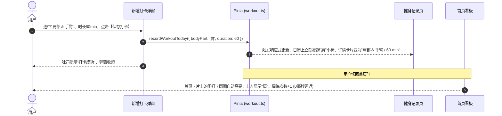

# 豆丁健身 (douding-fitness) - 健身记录页前端开发计划 (v1.0)

> **版本**：v1.0.0  
> **更新时间**：2026-10-08  
> **所属分支**：`feat/workout-page`  
> **设计依据**：基于用户高保真原型图 (`media_1791447532936_238a7ff6.png`)  
> **文档位置**：`d:\douding-fitness\docs\页面开发\健身记录页开发计划v1.md`

---

## 目录
1. [页面定位与核心交互诉求](#一-页面定位与核心交互诉求)
2. [高保真原型图视觉与组件结构拆解](#二-高保真原型图视觉与组件结构拆解)
3. [前端组件化架构设计](#三-前端组件化架构设计)
4. [核心逻辑与算法设计 (日历网格)](#四-核心逻辑与算法设计-日历网格)
5. [与 Pinia 全局状态及首页的数据联动](#五-与-pinia-全局状态及首页的数据联动)
6. [前端静态开发实施排期](#六-前端静态开发实施排期)

---

## 一、 页面定位与核心交互诉求

### 1.1 业务定位
健身记录页（`pages/workout/index`）是豆丁健身小程序的核心主功能页之一。主要承担：
1. **历史训练可视化看板**：以月度打卡日历形式直观展示整月训练频次，一眼即知哪天练了什么部位。
2. **训练明细速查**：点击任意日期，下方卡片即时呈现当天的训练时长、主练部位和完成状态。
3. **极简打卡录入**：提供底部显眼的「+ 添加今日训练」入口，唤起半屏抽屉弹窗，3秒内完成当日打卡记录。

---

## 二、 高保真原型图视觉与组件结构拆解

根据最新原型图，页面整体采用纯净简约的卡片式设计（白底 + 浅灰背景 `#F7F8FA` + 活力绿点缀 `#74C043` / `#67C23A`），由上至下划分为四大视觉模块：

```text
┌──────────────────────────────────────────────┐
│  十月 2026                            ‹   ›   │  ← 月份切换栏
│  日   一   二   三   四   五   六             │  ← 星期表头
│  28   29   30   1   [2]   3    4              │  ← 日历网格
│                 胸   肩        背             │  ← 部位绿色小胶囊徽章
│   5    6    7    8    9   10   11             │
│   腿        胸        肩                      │
└──────────────────────────────────────────────┘
┌──────────────────────────────────────────────┐
│  运动时间          训练内容          训练状态   │  ← 选中日训练总结卡片
│  60 min          肩部 & 手臂        [已完成]   │
└──────────────────────────────────────────────┘
                      ...
┌──────────────────────────────────────────────┐
│              + 添加今日训练                   │  ← 底部常驻悬浮主按钮
└──────────────────────────────────────────────┘
```

### 2.1 模块 1：月度打卡日历卡片 (`WorkoutCalendar.vue`)
- **月份导航**：
  - 左侧：大号加粗年月标题（如“十月 2026”）。
  - 右侧：精致的左右切换箭头按钮（‹ ›），支持翻看上一月/下一月。
- **星期表头**：
  - 一行 7 列：`日 一 二 三 四 五 六`，浅灰中性字色 `#8E8E93`。
- **日期网格 (7列 × 5~6行)**：
  - **非本月日期（上月末/下月初）**：数字浅灰透明化（`#CBD3DC`）。
  - **本月普通日期**：深黑清晰数字（`#111111`）。
  - **当前选中日期**：外圈呈现浅绿柔光圆环或柔和绿底，数字加粗。
  - **部位标签徽章 (核心亮点)**：
    - 在打过卡的日期数字正下方，渲染一个精致小巧的**绿色胶囊标签**（如 **“胸”**、**“肩”**、**“背”**、**“腿”**、**“腰”**）。
    - 尺寸精致紧凑（约 32rpx × 24rpx），白字加粗，间距得当。
    - 未打卡日期下方保持空白占位，确保网格行高绝对整齐。

### 2.2 模块 2：选中日训练详情卡片 (`WorkoutDetailCard.vue`)
- 点击日历中的任何一天，该卡片即时刷新：
  - **左列【运动时间】**：大号加粗数字 `60` + 小号单位 `min`。
  - **中列【训练内容】**：加粗展示训练肌群，如 `肩部 & 手臂`。
  - **右列【训练状态】**：绿色圆角胶囊标签，显示 `已完成`（或未打卡状态下显示“休息日”）。
- **空状态友好展示**：
  - 若选中的日期当天没有训练记录，该卡片展示“今日充碳休息”或“暂无训练数据”，并提供快捷记打卡引导。

### 2.3 模块 3：底部打卡主按钮
- 大圆角胶囊长条按钮（高度约 96rpx），横向满宽留边距。
- 渐变草绿色背景（`linear-gradient(135deg, #74C043 0%, #67C23A 100%)`）。
- 图标加文字：`+ 添加今日训练`，带柔和绿色发光投影。
- 避让底部原生 TabBar 与安全区（`env(safe-area-inset-bottom)`）。

### 2.4 模块 4：新增训练弹窗抽屉 (`AddWorkoutModal.vue`)
- 触发方式：点击「+ 添加今日训练」或日历空状态引导时从底部半屏弹出（Bottom Sheet）。
- 包含字段：
  1. **打卡日期**：默认为当前选中的日期，支持点击选择。
  2. **训练部位选择**：胶囊多选/单选按钮组（胸、背、肩、腿、手臂、核心、有氧）。
  3. **训练时长选择**：快捷选择标签（30 min、45 min、60 min、90 min）及手动加减步进器。
  4. **（可选）动作与组数速记**：简单的文本或多动作列表备注。
  5. **底部保存按钮**：点击保存，触发数据入库与日历即时点亮。

---

## 三、 前端组件化架构设计

按照项目既定的**页面私有组件就近存放规范**，所有组件放置在 `pages/workout/components/` 目录下：

```text
client/src/pages/workout/
├── components/
│   ├── WorkoutCalendar.vue       # 1. 核心日历卡片 (月份切换 + 7x6打卡网格 + 部位微标签)
│   ├── WorkoutDetailCard.vue     # 2. 选中日期训练详情卡片 (时长/内容/完成状态)
│   └── AddWorkoutModal.vue       # 3. 底部弹出半屏新增打卡弹窗
├── types.ts                      # 页面私有 TypeScript 类型定义
└── index.vue                     # 健身页主容器装配
```

### 3.1 类型定义规划 (`types.ts`)

```typescript
// 单日日历格子数据结构
export interface CalendarDayItem {
  year: number
  month: number
  date: number
  fullDateStr: string // "YYYY-MM-DD"
  isCurrentMonth: boolean
  isToday: boolean
  isSelected: boolean
  hasWorkout: boolean
  bodyPartBadge?: string // 如 "胸", "肩", "背"
}

// 选中日期的训练记录详情
export interface DayWorkoutDetail {
  recordId?: string
  date: string
  durationMinutes: number // 例如 60
  bodyPartsTitle: string  // 例如 "肩部 & 手臂"
  status: 'COMPLETED' | 'REST' // "已完成" 或 "休息"
  exercisesSummary?: string[]
}
```

---

## 四、 核心逻辑与算法设计 (日历网格)

为了保证日历对齐规范，采用标准的 **42格网格生成算法**（7列 × 6行）：

1. 获取当前展示月份的第 1 天是星期几（0~6）。
2. 计算上个月末需要补齐的天数，填入上月后几天。
3. 填入当前月份的所有真实天数（28~31天）。
4. 剩余格子用下月初的前几天补满至 35 或 42 格。
5. 将后端/Mock返回的月度打卡字典（以 `YYYY-MM-DD` 为 Key）与网格日期进行 O(1) 匹配，命中即挂载 `bodyPartBadge`。

---

## 五、 与 Pinia 全局状态及首页的数据联动

在 [`stores/workout.ts`](file:///d:/douding-fitness/client/src/stores/workout.ts) 中管理全局打卡数据：



---

## 六、 前端静态开发实施排期

- [ ] **Task 1**：编写 `client/src/pages/workout/types.ts` 定义完备的日历与记录数据模型。
- [ ] **Task 2**：开发 `WorkoutCalendar.vue`，实现 42 格日历排版算法、年月切换交互以及绿色部位徽章渲染。
- [ ] **Task 3**：开发 `WorkoutDetailCard.vue`，实现 3 列式时长/部位/状态展示及无记录空状态。
- [ ] **Task 4**：开发底部常驻「+ 添加今日训练」长条操作按钮。
- [ ] **Task 5**：开发 `AddWorkoutModal.vue` 录入抽屉，完成部位单选/多选胶囊和时长选择交互。
- [ ] **Task 6**：在 `index.vue` 中完成容器装配与假数据联调闭环。
